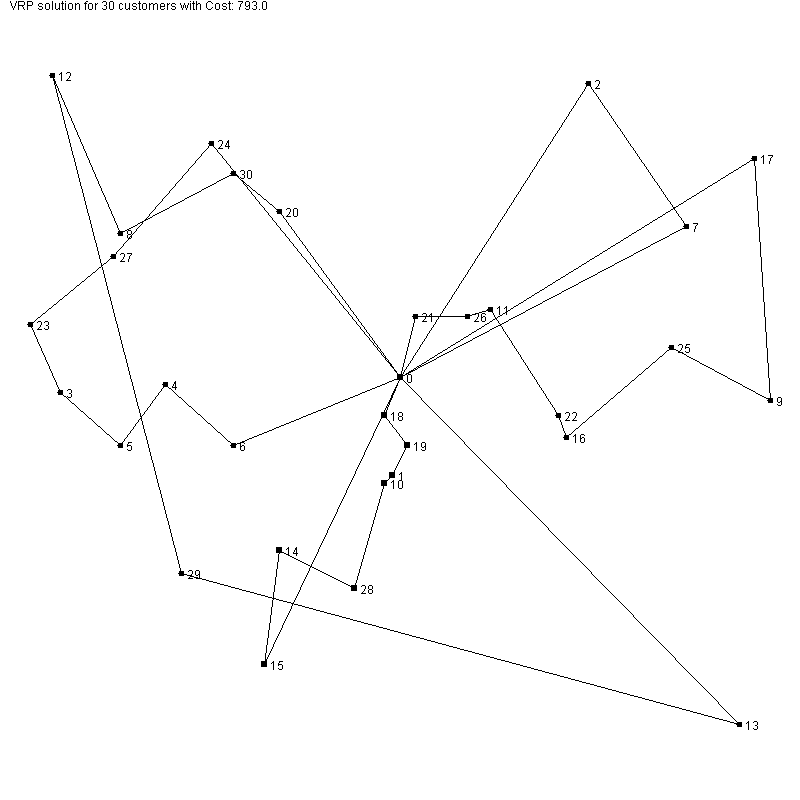
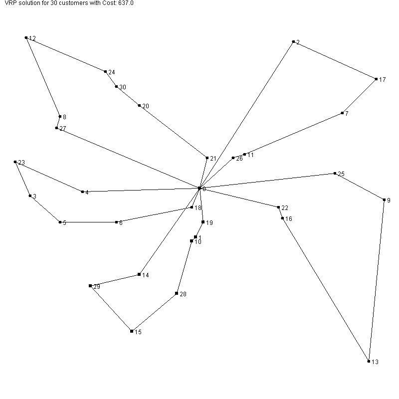

# Tabu Heuristics for Capacitated Vehicle Routing

- IT252 Desgin And Analysis of Algorithms (DAA) course project: Vehicle Routing Problem or simply VRP is a well known combinatorial optimization problem and a generalization of the travelling salesman problem. Finding optimal solution is a NP-hard problem so heurestic strategies are proposed for approximation of the optimal solution.
- Capacitated VRP is a special type of VRP. 

- For more details on the problem see: https://en.wikipedia.org/wiki/Vehicle_routing_problem

# Analysis

- Tabu search has the best perfomance; for an instance of the problem where we had 30 random placed customers and 10 vehicles: Greedy solution was 793 distance units (du), Intra Route Heuristic Algorithm gave 761 du , Inter Route 644 du amd finally Tabu Search gave 637 du after 200 iterations. 

- Tabu search has the flexibility to overcome local minimum so this is why we expect to be the beter strategy. In the next two images we visualize the greedy solution and the solution using Tabu search. 

Solution from Greedy search:

Solution using Tabu-meta heuristic:

# Presentation
The Presentation PDF is available here : https://rakeshpavan333.github.io/docs/daa_pro.pdf

# Contributors

- Rakesh Pavan (17IT154)
- Dhruvik Navadiya (17IT225)
- Neeraj Deshpande (17IT226)
- Yogesh Choubey (17IT252)
